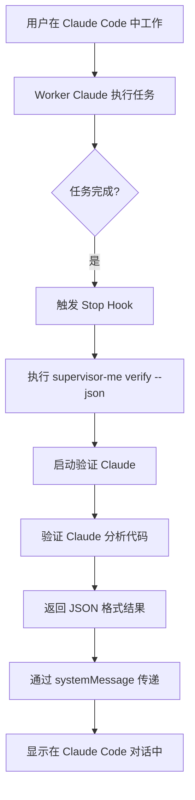

# Supervisor-ME 工作原理详解

## 🎯 核心问题：验证反馈如何传递？

### 工作流程



## 📋 详细步骤

### 1. 启动 Claude Code 会话
```bash
cd your-project
claude
```
当你启动 `claude` 时，Claude Code 会读取 `.claude/settings.json` 并加载 hooks。

### 2. 正常工作
```
你: "创建一个 add 函数"
Worker Claude: [创建代码...]
```

### 3. 任务完成时自动验证
当 Worker Claude 完成任务后，Stop hook 自动触发：

```bash
# .claude/hooks/stop.sh
supervisor-me verify --json
```

### 4. 验证过程
- `supervisor-me verify` 启动一个新的 Claude 实例（验证 Claude）
- 使用 `claude -p` 模式快速分析最近修改的文件
- 返回 JSON 格式的验证结果

### 5. 反馈传递机制

Stop hook 输出的 JSON 格式：
```json
{
  "continue": true,
  "systemMessage": "📋 验证反馈:\n[具体的验证内容]\n✅ 代码质量良好"
}
```

**关键点**：
- `systemMessage` 的内容会自动显示在 Claude Code 的对话中
- 这是 Claude Code 的内置机制，无需额外配置
- Worker Claude 和用户都能看到这个反馈

## 🔍 验证反馈的收集

### 反馈显示位置

1. **实时显示**（通过 systemMessage）
   - 在 Claude Code 对话中实时显示
   - 格式：`📋 验证反馈: [内容]`

2. **日志记录**
   - 保存在 `logs/supervisor-me/completions/stop.log`
   - 可以通过 `supervisor-me show-report` 查看历史

### 示例对话流程

```
用户: 创建一个计算器函数

Worker Claude: 我来创建一个计算器函数...
[创建 calculator.js]
✨ 完成！创建了基本的计算器函数。

[Stop Hook 触发]

系统消息: 📋 验证反馈:
说明: 检查了 calculator.js 文件，函数实现基本正确。
问题: 缺少错误处理和输入验证
建议: 添加对非数字输入的检查
✅ 代码质量良好

用户: [看到反馈后] 请添加输入验证

Worker Claude: 好的，我来添加输入验证...
```

## ❓ 常见问题

### Q: 为什么使用 `claude` 而不是其他命令？
A: 因为只有通过 `claude` 启动的会话才会加载 hooks。hooks 是 Claude Code 的内置机制。

### Q: 验证反馈去哪了？
A: 
1. **实时反馈**：通过 systemMessage 显示在对话中
2. **历史记录**：保存在日志文件中
3. **查看方式**：`supervisor-me show-report`

### Q: 如果看不到反馈怎么办？
1. 检查 hooks 是否正确配置：`supervisor-me status`
2. 查看日志：`tail -f logs/supervisor-me/completions/stop.log`
3. 手动测试：`bash .claude/hooks/stop.sh`

## 🔧 调试技巧

### 1. 验证 Stop Hook 输出
```bash
# 直接执行 hook，查看输出
bash .claude/hooks/stop.sh | python3 -m json.tool
```

### 2. 检查日志
```bash
# 查看最近的验证记录
supervisor-me show-report

# 实时监控
supervisor-me show-report --follow
```

### 3. 测试验证器
```bash
# 手动触发验证
supervisor-me verify

# 查看 JSON 输出
supervisor-me verify --json
```

## 🎨 架构优势

1. **无侵入性**：不改变 Claude Code 的使用习惯
2. **自动化**：任务完成时自动验证
3. **透明性**：反馈直接显示在对话中
4. **可追溯**：所有验证记录都有日志

## 📝 总结

- **启动方式**：必须用 `claude` 命令启动会话
- **反馈机制**：通过 Stop hook 的 systemMessage 自动显示
- **查看历史**：使用 `supervisor-me show-report`
- **核心价值**：让 Worker Claude 的输出质量自动提升