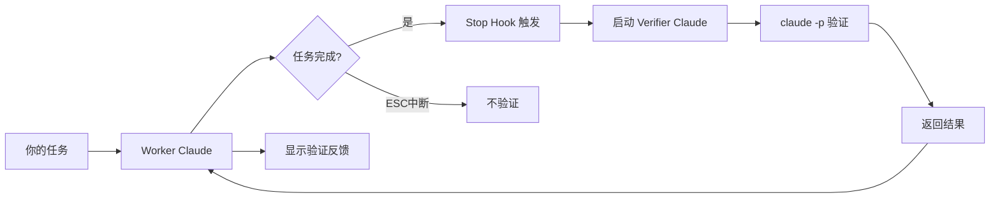

# Supervisor-ME 🤖

> 双 Claude 智能验证系统 - 让你的代码质量自动提升

## 🌟 核心特性

**双 Claude 协作架构**
- 🤖 **Worker Claude**：执行你的编程任务
- 🔍 **Verifier Claude**：智能验证任务质量  
- 🎯 **自然语言理解**：不依赖固定模式，真正理解任务
- ⚡ **claude -p 模式**：快速验证，无需交互

## 🎯 设计理念

**"验证完成，而非监督过程"**
- ✅ 任务完成时，自动启动第二个 Claude 验证
- ❌ 用户按 ESC 中断时，不干扰（用户在控制）
- 💡 验证结果返回给 Worker Claude，由它传达给你

## 🚀 快速开始

### 方式一：本地安装（推荐）

```bash
# 1. 克隆项目
git clone https://github.com/yourusername/supervisor-me-mvp.git
cd supervisor-me-mvp

# 2. 全局链接
npm link

# 3. 在你的项目中初始化
cd your-project
supervisor-me init

# 4. 启动 Claude Code（hooks 会自动生效）
claude

# 5. 正常工作，验证会在任务完成时自动运行
# 验证反馈会通过 systemMessage 显示在对话中
```

### 方式二：NPM 包安装（即将发布）

```bash
# 全局安装（待发布）
npm install -g supervisor-me

# 在项目中初始化
cd your-project
supervisor-me init

# 查看验证报告
supervisor-me show-report

# 查看系统状态
supervisor-me status
```

### 方式三：手动安装

```bash
# 1. 克隆 Supervisor-ME 到任意位置
git clone https://github.com/yourusername/supervisor-me-mvp.git ~/supervisor-me

# 2. 进入你的项目目录
cd your-project

# 3. 复制必要文件
cp -r ~/supervisor-me/.claude .
cp -r ~/supervisor-me/lib .

# 4. 开始使用 Claude Code
claude
```

## 📁 项目结构

```
supervisor-me-mvp/
├── .claude/
│   ├── settings.json              # Hooks 配置
│   └── hooks/
│       ├── stop.sh                # 任务完成时触发验证
│       ├── post-tool-use.sh       # 文件修改后快速检查
│       └── user-prompt-submit.sh  # 记录用户意图
├── lib/
│   ├── claude-verify-simple.js    # 🌟 双 Claude 验证器（claude -p 模式）
│   ├── verify-completion.js       # 备用：模式匹配验证
│   ├── quick-check.js            # 语法快速检查
│   ├── inquiry-generator.js      # 智能问题生成
│   └── project-analyzer.js       # 项目结构分析
└── logs/
    ├── completions/              # 验证历史记录
    ├── checks/                   # 语法检查日志
    └── intents/                  # 用户意图记录
```

## 🎨 工作原理



### 详细流程

1. **你提交任务** → Worker Claude 执行
2. **任务完成** → Stop Hook 自动触发
3. **检查环境变量** → 避免验证循环
4. **启动 Verifier Claude** → 使用 `claude -p` 模式
5. **智能分析** → 检查语法、逻辑、完成度
6. **返回反馈** → 显示 "📋 验证 Claude 反馈: ..."

## 📊 CLI 命令

```bash
# 初始化项目（智能合并，不影响现有 hooks）
supervisor-me init

# 查看验证报告（类似 playwright show-report）
supervisor-me show-report          # 最近10条
supervisor-me show-report -n 20    # 最近20条
supervisor-me show-report --follow # 实时跟踪
supervisor-me show-report --json   # JSON格式

# 查看系统状态
supervisor-me status

# 测试验证功能
supervisor-me test

# 清理日志
supervisor-me clean        # 清理30天前的日志
supervisor-me clean --all  # 清理所有日志
```

## 💡 使用场景

### 场景 1：创建新功能
```
你: 创建一个用户登录功能
Worker Claude: [创建代码...]
Worker Claude: ✨ 登录功能创建完成！

[自动验证]
📋 验证 Claude 反馈: 代码结构良好，建议添加输入验证
```

### 场景 2：修复 Bug
```
你: 修复登录验证的问题
Worker Claude: [修改代码...]
Worker Claude: ✨ Bug 修复完成！

[自动验证]
📋 验证 Claude 反馈: 验证逻辑已修复，语法正确
```

### 场景 3：用户中断（不验证）
```
你: 重构整个项目
Worker Claude: [开始重构...]
你: [按 ESC]
Worker Claude: [停止]

[无验证 - 这是正确的行为]
```

## ⚙️ 配置说明

### .claude/settings.json
```json
{
  "hooks": {
    "Stop": ".claude/hooks/stop.sh",
    "PostToolUse": {
      "Write": ".claude/hooks/post-tool-use.sh",
      "Edit": ".claude/hooks/post-tool-use.sh",
      "MultiEdit": ".claude/hooks/post-tool-use.sh"
    },
    "UserPromptSubmit": ".claude/hooks/user-prompt-submit.sh"
  }
}
```

### 环境变量
- `CLAUDE_VERIFIER_MODE=true`：标记验证 Claude，防止循环
- `NODE_NO_WARNINGS=1`：抑制 Node.js 警告

## 🔍 验证策略

Verifier Claude 会智能分析：

| 检查项 | 说明 |
|--------|------|
| **语法正确性** | 代码是否有语法错误 |
| **任务完成度** | 是否真正完成了请求的功能 |
| **文件创建** | 新文件是否成功创建 |
| **测试覆盖** | 是否需要运行测试 |
| **最佳实践** | 代码质量和规范性 |

## 📊 查看日志

```bash
# 实时查看验证日志
tail -f logs/completions/stop.log

# 查看语法检查记录
tail -f logs/checks/tools.log

# 查看用户意图历史
cat logs/intents/intents.log
```

## 🛠 故障排除

### 验证没有触发？
1. 确认在新的 Claude 会话中（hooks 在启动时加载）
2. 检查 `.claude/settings.json` 配置正确
3. 确认 hook 脚本有执行权限：`chmod +x .claude/hooks/*.sh`

### 验证超时？
- 这是正常的，会显示 "验证超时，默认通过"
- 可以调整 `lib/claude-verify-simple.js` 中的超时时间

### 想要禁用验证？
- 临时禁用：设置环境变量 `CLAUDE_VERIFIER_MODE=true`
- 永久禁用：删除 `.claude/settings.json` 中的 Stop hook

## 🎯 最佳实践

### ✅ 推荐做法
1. **让验证自动运行** - 不要手动干预
2. **关注验证反馈** - 及时修复发现的问题
3. **保持项目整洁** - 验证器会检查最近修改的文件

### ❌ 避免做法
1. **频繁中断任务** - 会错过验证机会
2. **忽略验证反馈** - 可能积累技术债务
3. **修改验证逻辑** - 除非你理解其工作原理

## ✅ 已修复问题

- **Shell 语法警告**：修复了所有 shell 脚本的语法问题
- **JSON 输出错误**：修复了 `--json` 选项的参数解析和输出格式
- **Claude 错误输出**：使用 stderr 重定向避免污染验证结果
- **字符转义问题**：增强了 shell 特殊字符的转义处理

## 🧪 测试

运行端到端测试：

```bash
# 运行完整测试套件
./test-e2e.sh

# 运行集成测试
node test-integration.js
```

## 🚧 高级功能

### 自定义验证提示
编辑 `lib/claude-verify-simple.js` 中的 `buildPrompt` 方法：

```javascript
buildPrompt(context) {
    // 添加你的自定义验证逻辑
    let prompt = '作为代码验证助手...';
    // ...
}
```

### 集成到 CI/CD
```yaml
# .github/workflows/verify.yml
- name: Run Supervisor Verification
  run: |
    node lib/claude-verify-simple.js --project-root .
```

## 📈 架构优势

| 特性 | 说明 |
|------|------|
| **智能化** | 使用 Claude 理解任务，不依赖模式匹配 |
| **非侵入** | 通过 Hooks 集成，不改变使用习惯 |
| **防循环** | 环境变量机制避免无限验证 |
| **快速响应** | claude -p 模式，30秒内完成 |
| **可扩展** | 易于自定义验证策略 |

## 🤔 常见问题

**Q: 这会影响 Claude Code 的速度吗？**
A: 不会。验证是在任务完成后异步执行的。

**Q: 验证 Claude 使用什么模型？**
A: 使用与 Worker Claude 相同的模型和参数。

**Q: 可以看到验证 Claude 的思考过程吗？**
A: 目前使用 -p 模式只返回结果。如需详细过程，可以修改为交互模式。

**Q: 支持哪些编程语言？**
A: 所有 Claude 支持的语言。验证器会理解上下文并智能判断。

## 🚀 快速测试

想立即体验验证功能？

```bash
# 1. 测试验证功能
supervisor-me test

# 2. 或手动创建文件并验证
echo "console.log('Hello World');" > test.js
supervisor-me verify

# 3. 查看验证报告
supervisor-me show-report
```

## 📄 项目文件

| 文件 | 说明 |
|------|------|
| `bin/supervisor-me` | CLI 主入口 |
| `lib/claude-verify-simple.js` | 核心验证器 |
| `.claude/hooks/stop.sh` | Stop Hook 脚本 |
| `test-e2e.sh` | 端到端测试脚本 |
| `test-integration.js` | 集成测试 |

## 🔄 反馈机制说明

### 验证反馈如何显示？

1. **实时反馈**：当 Worker Claude 完成任务后，Stop hook 自动触发，验证结果通过 `systemMessage` 显示在 Claude Code 对话中

2. **日志记录**：所有验证结果保存在 `logs/supervisor-me/completions/stop.log`

3. **查看历史**：
   ```bash
   # 查看最近的验证记录
   supervisor-me show-report
   
   # 实时监控验证日志
   supervisor-me show-report --follow
   ```

### 为什么用 `claude` 命令？

- `claude` 命令启动的会话会加载 `.claude/settings.json` 中的 hooks
- hooks 是 Claude Code 的内置机制，只有通过 `claude` 启动才能生效
- 验证反馈通过 Stop hook 的 `systemMessage` 自动传递给 Worker Claude

## 🎯 项目状态

| 功能 | 状态 |
|------|------|
| 核心验证功能 | ✅ 完成 |
| CLI 工具 | ✅ 完成 |
| JSON 输出 | ✅ 已修复 |
| 防循环机制 | ✅ 完成 |
| 端到端测试 | ✅ 完成 |
| NPM 发布 | ⏳ 待完成 |

## 🙏 贡献

欢迎提交 Issue 和 Pull Request！

## 📄 许可证

MIT License

---

**记住**：我们的目标是帮助而非监督。让 Claude 更聪明，让编程更愉快！ 🚀