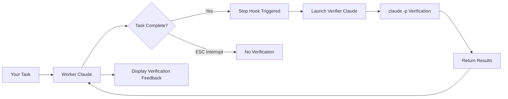

# CC-Supervisor (Claude Code Supervisor) 🤖

> AI-powered dual-Claude verification system for automatic code quality improvement

## 🌟 Key Features

**Dual Claude Collaboration Architecture**
- 🤖 **Worker Claude**: Executes your programming tasks
- 🔍 **Verifier Claude**: Intelligently verifies task quality
- 🎯 **Natural Language Understanding**: True task comprehension without rigid patterns
- ⚡ **claude -p mode**: Fast verification without interaction

## 🎯 Design Philosophy

**"Verify Completion, Not Supervise Process"**
- ✅ Automatically launches second Claude for verification when tasks complete
- ❌ No interference when user interrupts with ESC (user in control)  
- 💡 Verification results return to Worker Claude for communication

## 🚀 Quick Start

### Option 1: NPM Installation (Recommended)

```bash
# Global installation
npm install -g ho-cc-supervisor

# Initialize in your project
cd your-project
cc-supervisor init

# Start Claude Code (hooks activate automatically)
claude

# Work normally - verification runs automatically on task completion
# Verification feedback appears via systemMessage in conversation
```

### Option 2: Local Installation

```bash
# 1. Clone repository
git clone https://github.com/yourusername/cc-supervisor.git
cd cc-supervisor

# 2. Global link
npm link

# 3. Initialize in your project
cd your-project
cc-supervisor init

# 4. Start Claude Code
claude
```

### Option 3: Manual Installation

```bash
# 1. Clone CC-Supervisor anywhere
git clone https://github.com/yourusername/cc-supervisor.git ~/cc-supervisor

# 2. Enter your project directory
cd your-project

# 3. Copy necessary files
cp -r ~/cc-supervisor/.claude .
cp -r ~/cc-supervisor/lib .

# 4. Start using Claude Code
claude
```

## 📁 Project Structure

```
cc-supervisor/
├── .claude/
│   ├── settings.json              # Hooks configuration
│   └── hooks/
│       ├── stop.sh                # Triggers verification on completion
│       ├── post-tool-use.sh       # Quick check after file modifications
│       └── user-prompt-submit.sh  # Records user intent
├── lib/
│   ├── claude-verify-simple.js    # 🌟 Dual Claude verifier (claude -p mode)
│   ├── verify-completion.js       # Fallback: pattern matching verification
│   ├── quick-check.js            # Syntax quick check
│   ├── inquiry-generator.js      # Intelligent question generation
│   └── project-analyzer.js       # Project structure analysis
├── bin/
│   ├── cc-supervisor              # CLI tool
│   └── cc-supervisor-claude.js    # Transparent proxy for auto-feedback
└── logs/
    ├── completions/              # Verification history
    ├── checks/                   # Syntax check logs
    └── intents/                  # User intent records
```

## 🎨 How It Works



### Detailed Flow

1. **You submit task** → Worker Claude executes
2. **Task completes** → Stop Hook triggers automatically
3. **Check environment** → Avoid verification loops
4. **Launch Verifier Claude** → Using `claude -p` mode
5. **Intelligent analysis** → Check syntax, logic, completion
6. **Return feedback** → Displays "📋 Verifier Claude feedback: ..."

## 📊 CLI Commands

```bash
# Initialize project (smart merge, preserves existing hooks)
cc-supervisor init

# View verification reports (like playwright show-report)
cc-supervisor show-report              # Last 10 entries
cc-supervisor show-report -n 20        # Last 20 entries
cc-supervisor show-report --follow     # Real-time tracking
cc-supervisor show-report --json       # JSON format
cc-supervisor show-report --detailed   # Show detailed verification logs
cc-supervisor show-report --latest     # Show latest complete verification result

# Check system status
cc-supervisor status

# Test verification functionality
cc-supervisor test

# Clean logs
cc-supervisor clean        # Clean logs older than 30 days
cc-supervisor clean --all  # Clean all logs
```

## 🤖 Auto-Feedback Mode (cc-supervisor-claude)

For fully automated workflow with continuous feedback:

```bash
# Start transparent proxy with auto-feedback
cc-supervisor-claude

# Or specify session ID
cc-supervisor-claude --session <uuid>

# Debug mode
cc-supervisor-claude --debug
```

This mode:
- Transparently proxies all Claude interactions
- Automatically injects verification feedback
- Monitors for issues and auto-submits corrections
- Provides seamless Worker-Verifier collaboration

## 💡 Usage Scenarios

### Scenario 1: Create New Feature
```
You: Create a user login feature
Worker Claude: [Creates code...]
Worker Claude: ✨ Login feature created!

[Auto-verification]
📋 Verifier Claude feedback: Code structure good, suggest adding input validation
```

### Scenario 2: Fix Bug
```
You: Fix the login validation issue
Worker Claude: [Modifies code...]
Worker Claude: ✨ Bug fixed!

[Auto-verification]
📋 Verifier Claude feedback: Validation logic fixed, syntax correct
```

### Scenario 3: User Interrupt (No verification)
```
You: Refactor entire project
Worker Claude: [Starting refactor...]
You: [Press ESC]
Worker Claude: [Stops]

[No verification - correct behavior]
```

## ⚙️ Configuration

### .claude/settings.json
```json
{
  "hooks": {
    "Stop": [
      {
        "hooks": [
          {
            "type": "command",
            "command": "bash $CLAUDE_PROJECT_DIR/.claude/hooks/stop.sh"
          }
        ]
      }
    ],
    "PostToolUse": [
      {
        "matcher": "Write|Edit|MultiEdit",
        "hooks": [
          {
            "type": "command",
            "command": "bash $CLAUDE_PROJECT_DIR/.claude/hooks/post-tool-use.sh $FILE_PATH"
          }
        ]
      }
    ],
    "UserPromptSubmit": [
      {
        "hooks": [
          {
            "type": "command",
            "command": "bash $CLAUDE_PROJECT_DIR/.claude/hooks/user-prompt-submit.sh \"$USER_PROMPT\""
          }
        ]
      }
    ]
  }
}
```

### Environment Variables
- `CLAUDE_VERIFIER_MODE=true`: Marks verifier Claude, prevents loops
- `NODE_NO_WARNINGS=1`: Suppresses Node.js warnings

## 🔍 Verification Strategy

Verifier Claude intelligently analyzes:

| Check Item | Description |
|------------|-------------|
| **Syntax Correctness** | Any syntax errors in code |
| **Task Completion** | Whether requested functionality is complete |
| **File Creation** | New files successfully created |
| **Test Coverage** | Whether tests should run |
| **Best Practices** | Code quality and standards |

## 📊 View Logs

```bash
# Real-time verification logs
tail -f logs/completions/stop.log

# Syntax check records
tail -f logs/checks/tools.log

# User intent history
cat logs/intents/intents.log
```

## 🛠 Troubleshooting

### Verification not triggering?
1. Confirm in new Claude session (hooks load at startup)
2. Check `.claude/settings.json` configured correctly
3. Confirm hook scripts have execute permission: `chmod +x .claude/hooks/*.sh`

### Verification timeout?
- Normal behavior, shows "Verification timeout, defaulting to pass"
- Adjust timeout in `lib/claude-verify-simple.js`

### Want to disable verification?
- Temporary: Set environment variable `CLAUDE_VERIFIER_MODE=true`
- Permanent: Remove Stop hook from `.claude/settings.json`

## 🎯 Best Practices

### ✅ Recommended
1. **Let verification run automatically** - Don't manually intervene
2. **Pay attention to feedback** - Fix discovered issues promptly
3. **Keep project clean** - Verifier checks recently modified files

### ❌ Avoid
1. **Frequent task interruption** - Misses verification opportunities
2. **Ignoring verification feedback** - May accumulate technical debt
3. **Modifying verification logic** - Unless you understand how it works

## 📝 License

MIT

## 🤝 Contributing

Contributions welcome! Please read our contributing guidelines first.

## 🔗 Links

- [Documentation](./docs/)
- [中文文档](./README_CN.md)
- [Issues](https://github.com/yourusername/cc-supervisor/issues)
- [NPM Package](https://www.npmjs.com/package/ho-cc-supervisor)

---

Made with ❤️ by the CC-Supervisor team