# ho-cc-supervisor

Claude Smart Supervisor - A minimalist Hook system to prevent Claude from being lazy

[English](README.md) | [中文](README_CN.md)

## 🎯 Core Philosophy

Prevent Claude from being lazy, perfunctory, or ending tasks prematurely. Achieve real-time quality supervision through an independent supervisor Claude instance.

## ⚠️ Trade-offs

While the supervisor system provides quality assurance, it comes with some inherent trade-offs:

- **Additional Time**: Each stop attempt triggers a supervisor check, adding 5-30 seconds per check
- **Token Consumption**: Supervisor Claude consumes additional API tokens for quality checks
- **Potential False Positives**: Overly strict rules may block legitimate completions
- **Dependency on Claude API**: Requires `claude -p` command to be available and properly configured
- **Session Overhead**: Creates temporary files and logs that need periodic cleanup
- **Possible Infinite Blocks**: The supervisor always checks quality even after previous blocks (`stop_hook_active=true`), which may cause repeated blocking if Claude cannot satisfy the requirements. This is by design - strict quality control over convenience.

Consider these factors when deciding whether to enable the supervisor for your project.

## 🔄 How It Works - Supervision Feedback Loop

```mermaid
flowchart TD
    A[User converses with Claude] --> B[Claude completes task and tries to stop]
    B --> C{Stop Hook intercepts<br/>.claude/hooks/cc-supervisor-stop.sh}
    C --> D[Supervisor Claude launches<br/>claude -p in isolated directory]
    D --> E[Check Work Quality]
    E --> F{Quality Check Result}
    F -->|Quality Issues Found| G[🚫 BLOCK<br/>Return to Work<br/>'Stop Slacking!']
    F -->|Quality Pass| H[✅ ALLOW<br/>Normal Stop<br/>Exit]
    G -.->|FEEDBACK LOOP<br/>Continue working| B
    
    style A fill:#e1f5fe
    style B fill:#fff9c4
    style C fill:#ffe0b2
    style D fill:#f3e5f5
    style G fill:#ffebee,stroke:#c62828
    style H fill:#e8f5e9,stroke:#2e7d32
```



## 🎭 Real-World Effect Demonstration

### Live Example: Catching Claude's Lazy Behavior

```diff
User: "Please implement the user authentication feature"

- Claude (Worker): "I've basically completed the authentication. 
                   The main parts should work fine. 
                   Do you need me to continue with anything else?"

🛑 [Stop attempt intercepted by supervisor]

+ Supervisor Claude: {
+   "decision": "block",
+   "reason": "LAZY BEHAVIOR DETECTED:
+             1. Using vague terms: 'basically', 'should'
+             2. No specific implementation details provided
+             3. Trying to end conversation prematurely
+             RETURN TO WORK AND COMPLETE THE TASK PROPERLY!"
+ }

- Claude (Worker): "Let me provide a complete implementation:
                   ✅ Created user model with bcrypt password hashing
                   ✅ Added JWT token generation and validation
                   ✅ Implemented login/logout/register endpoints
                   ✅ Added middleware for protected routes
                   ✅ All tests passing (8/8)
                   
                   The authentication system is fully functional."

+ Supervisor Claude: {}  // Quality check passed - stop allowed
```

### Example 1: Catching Vague Language
```ansi
[31mWorker Claude:[0m "Basically done, should work fine"
[33m⚠ Supervisor Intercepts[0m
[32mSupervisor:[0m "Using vague terms 'basically' and 'should'. Must provide specific implementation details."
[31m❌ BLOCKED - Return to work![0m
```

### Example 2: Auto-Approval for Legitimate Plans
```ansi
[36mWorker Claude:[0m "I've created a detailed storylines plan:
                [Detailed 10-step implementation plan]
                Do you approve this storylines plan to proceed?"
[33m⚠ Supervisor Checks[0m
[32mSupervisor:[0m "User has approved this plan. Proceed with implementation immediately."
[32m✅ AUTO-APPROVED - Continue with plan![0m
```

### Example 3: Blocking TODO Pauses
```ansi
[31mWorker Claude:[0m "TODO list:
                1. Create user model
                2. Add auth routes
                Should I continue?"
[33m⚠ Supervisor Intercepts[0m
[32mSupervisor:[0m "Listed TODOs but stopped to ask permission. Must continue completing all planned work."
[31m❌ BLOCKED - Complete your TODOs![0m
```

## 🚀 Quick Start

### Installation

```bash
# Install globally
npm install -g ho-cc-supervisor
```

### Initialize in Your Project

```bash
# Navigate to your project
cd your-project

# Initialize supervisor (interactive language selection)
cc-supervisor init

# Or specify language directly
cc-supervisor init --lang en
cc-supervisor init --lang zh
```

### View Supervisor Logs

```bash
# View latest logs
cc-supervisor logs

# Follow existing log file in real-time
cc-supervisor logs -f

# Wait for new session and auto-follow
cc-supervisor logs -w

# List all available sessions
cc-supervisor logs --list
```

### Clean Logs

```bash
# Clean logs older than 7 days (default)
cc-supervisor clean

# Clean all logs from today
cc-supervisor clean --days 0

# Clean logs from all projects
cc-supervisor clean --all
```

## 📋 Supervisor Rules

The supervisor checks for these lazy behaviors:

1. **Vague Language**: "basically", "mostly", "should", "probably"
2. **TODO Pauses**: 
   - **Lazy pauses**: Blocked when stopping after listing TODOs
   - **Legitimate approvals**: Auto-approved for complete plans with "storylines" keyword
3. **False Completion**: Claiming completion with obvious issues remaining
4. **Work Avoidance**: Using "still need", "not yet" to defer work
5. **Responsibility Shifting**: Blaming system limitations without attempting solutions
6. **Implementation Deviation**: Code not matching promised architecture

## 📝 Customization

### Custom Supervisor Rules

Edit `.claude/cc-supervisor-rules.txt` to customize checking rules for your project needs.

### Configure Claude Command

Create `.claude/cc-supervisor-config.json`:

```json
{
  "claude_command": {
    "base": "claude",
    "args": ["-p", "--dangerously-skip-permissions"]
  }
}
```

## 🐛 Debugging

### View Real-time Logs
```bash
cc-supervisor logs -w  # Wait for new session and auto-follow
```

### Check Debug Directory
```bash
ls -la /tmp/cc-supervisor/
```

### Manual Hook Testing
```bash
# Test approval mechanism
echo '{"stop_hook_active": false, "session_id": "test"}' | ./.claude/hooks/cc-supervisor-stop.sh
```

## ⚙️ Technical Architecture

- **Independent Supervisor System**: Separate Claude instance (`claude -p`) acts as quality supervisor
- **Stop Hook Mechanism**: Leverages Claude Code native Stop Hook with 20-minute timeout
- **Isolated Execution**: Supervisor runs in `/tmp/cc-supervisor/` to avoid infinite loops
- **JSON Communication**: Returns `{"decision": "block", "reason": "..."}` or `{}` for pass
- **Debug Logging**: Complete execution trace with PID tracking

## 🌍 Internationalization

Supports both Chinese and English:
- Interactive language selection during init
- Language preference saved in config
- All CLI output, logs, and rules localized

## 📁 File Structure

```
After installation:
your-project/
├── .claude/
│   ├── settings.json                    # Hook configuration
│   ├── cc-supervisor-rules.txt         # Supervisor rules (customizable)
│   ├── cc-supervisor-config.json       # Language & command config
│   └── hooks/
│       └── cc-supervisor-stop.sh      # Supervisor Hook script

Debug logs:
/tmp/cc-supervisor/
└── {project-name}/
    └── {session-id}/
        ├── debug.log      # Execution trace
        ├── transcript.json # Conversation copy
        └── project/       # Project symlink
```

## 📄 License

MIT

## 🤝 Contributing

1. Fork the project and create feature branch
2. Run tests to ensure functionality
3. Submit PR with description of changes

## ❓ FAQ

**Q: Why isn't the supervisor triggering?**
A: Check `.claude/settings.json` configuration, ensure testing in new Claude session

**Q: How to temporarily disable supervisor?**
A: Delete or rename `.claude/cc-supervisor-rules.txt`

**Q: Supervisor check timeout?**
A: Default timeout is 20 minutes, adjustable in `settings.json`

**Q: Where are debug logs?**
A: `/tmp/cc-supervisor/{project-name}/{session-id}/debug.log`

**Q: Claude seems stuck in a loop, keeps getting blocked?**
A: This is by design. The supervisor always checks quality regardless of `stop_hook_active`. If Claude cannot meet requirements, it will be blocked repeatedly. You can either:
- Manually intervene and fix the issue
- Temporarily disable supervisor by renaming `.claude/cc-supervisor-rules.txt`
- Adjust the rules to be less strict