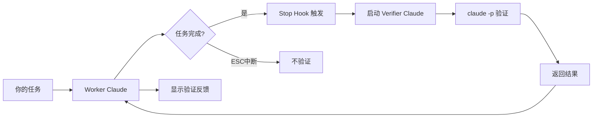

# CC-Supervisor (Claude Code Supervisor) 🤖

> AI 驱动的双 Claude 验证系统 - 自动提升代码质量

## 🌟 核心特性

**双 Claude 协作架构**
- 🤖 **Worker Claude**：执行你的编程任务
- 🔍 **Verifier Claude**：智能验证任务质量  
- 🎯 **自然语言理解**：不依赖固定模式，真正理解任务
- ⚡ **claude -p 模式**：快速验证，无需交互

## 🎯 设计理念

**"验证完成，而非监督过程"**
- ✅ 任务完成时，自动启动第二个 Claude 验证
- ❌ 用户按 ESC 中断时，不干扰（用户在控制）
- 💡 验证结果返回给 Worker Claude，由它传达给你

## 🚀 快速开始

### 方式一：NPM 安装（推荐）

```bash
# 全局安装
npm install -g @ho/cc-supervisor

# 在项目中初始化
cd your-project
cc-supervisor init

# 启动 Claude Code（hooks 会自动生效）
claude

# 正常工作，验证会在任务完成时自动运行
# 验证反馈会通过 systemMessage 显示在对话中
```

### 方式二：本地安装

```bash
# 1. 克隆仓库
git clone https://github.com/yourusername/cc-supervisor.git
cd cc-supervisor

# 2. 全局链接
npm link

# 3. 在你的项目中初始化
cd your-project
cc-supervisor init

# 4. 启动 Claude Code
claude
```

### 方式三：手动安装

```bash
# 1. 克隆 CC-Supervisor 到任意位置
git clone https://github.com/yourusername/cc-supervisor.git ~/cc-supervisor

# 2. 进入你的项目目录
cd your-project

# 3. 复制必要文件
cp -r ~/cc-supervisor/.claude .
cp -r ~/cc-supervisor/lib .

# 4. 开始使用 Claude Code
claude
```

## 📁 项目结构

```
cc-supervisor/
├── .claude/
│   ├── settings.json              # Hooks 配置
│   └── hooks/
│       ├── stop.sh                # 任务完成时触发验证
│       ├── post-tool-use.sh       # 文件修改后快速检查
│       └── user-prompt-submit.sh  # 记录用户意图
├── lib/
│   ├── claude-verify-simple.js    # 🌟 双 Claude 验证器（claude -p 模式）
│   ├── verify-completion.js       # 备用：模式匹配验证
│   ├── quick-check.js            # 语法快速检查
│   ├── inquiry-generator.js      # 智能问题生成
│   └── project-analyzer.js       # 项目结构分析
├── bin/
│   ├── cc-supervisor              # CLI 工具
│   └── cc-supervisor-claude.js    # 自动反馈的透明代理
└── logs/
    ├── completions/              # 验证历史记录
    ├── checks/                   # 语法检查日志
    └── intents/                  # 用户意图记录
```

## 🎨 工作原理



### 详细流程

1. **你提交任务** → Worker Claude 执行
2. **任务完成** → Stop Hook 自动触发
3. **检查环境变量** → 避免验证循环
4. **启动 Verifier Claude** → 使用 `claude -p` 模式
5. **智能分析** → 检查语法、逻辑、完成度
6. **返回反馈** → 显示 "📋 验证 Claude 反馈: ..."

## 📊 CLI 命令

```bash
# 初始化项目（智能合并，不影响现有 hooks）
cc-supervisor init

# 查看验证报告（类似 playwright show-report）
cc-supervisor show-report          # 最近10条
cc-supervisor show-report -n 20    # 最近20条
cc-supervisor show-report --follow # 实时跟踪
cc-supervisor show-report --json   # JSON格式

# 查看系统状态
cc-supervisor status

# 测试验证功能
cc-supervisor test

# 清理日志
cc-supervisor clean        # 清理30天前的日志
cc-supervisor clean --all  # 清理所有日志
```

## 🤖 自动反馈模式 (cc-supervisor-claude)

实现完全自动化的工作流，持续反馈：

```bash
# 启动透明代理，自动反馈
cc-supervisor-claude

# 或指定 session ID
cc-supervisor-claude --session <uuid>

# 调试模式
cc-supervisor-claude --debug
```

该模式特点：
- 透明代理所有 Claude 交互
- 自动注入验证反馈
- 监控问题并自动提交修正
- 提供无缝的 Worker-Verifier 协作

## 💡 使用场景

### 场景 1：创建新功能
```
你: 创建一个用户登录功能
Worker Claude: [创建代码...]
Worker Claude: ✨ 登录功能创建完成！

[自动验证]
📋 验证 Claude 反馈: 代码结构良好，建议添加输入验证
```

### 场景 2：修复 Bug
```
你: 修复登录验证的问题
Worker Claude: [修改代码...]
Worker Claude: ✨ Bug 修复完成！

[自动验证]
📋 验证 Claude 反馈: 验证逻辑已修复，语法正确
```

### 场景 3：用户中断（不验证）
```
你: 重构整个项目
Worker Claude: [开始重构...]
你: [按 ESC]
Worker Claude: [停止]

[无验证 - 这是正确的行为]
```

## ⚙️ 配置说明

### .claude/settings.json
```json
{
  "hooks": {
    "Stop": ".claude/hooks/stop.sh",
    "PostToolUse": {
      "Write": ".claude/hooks/post-tool-use.sh",
      "Edit": ".claude/hooks/post-tool-use.sh",
      "MultiEdit": ".claude/hooks/post-tool-use.sh"
    },
    "UserPromptSubmit": ".claude/hooks/user-prompt-submit.sh"
  }
}
```

### 环境变量
- `CLAUDE_VERIFIER_MODE=true`：标记验证 Claude，防止循环
- `NODE_NO_WARNINGS=1`：抑制 Node.js 警告

## 🔍 验证策略

Verifier Claude 会智能分析：

| 检查项 | 说明 |
|--------|------|
| **语法正确性** | 代码是否有语法错误 |
| **任务完成度** | 是否真正完成了请求的功能 |
| **文件创建** | 新文件是否成功创建 |
| **测试覆盖** | 是否需要运行测试 |
| **最佳实践** | 代码质量和规范性 |

## 📊 查看日志

```bash
# 实时查看验证日志
tail -f logs/completions/stop.log

# 查看语法检查记录
tail -f logs/checks/tools.log

# 查看用户意图历史
cat logs/intents/intents.log
```

## 🛠 故障排除

### 验证没有触发？
1. 确认在新的 Claude 会话中（hooks 在启动时加载）
2. 检查 `.claude/settings.json` 配置正确
3. 确认 hook 脚本有执行权限：`chmod +x .claude/hooks/*.sh`

### 验证超时？
- 这是正常的，会显示 "验证超时，默认通过"
- 可以调整 `lib/claude-verify-simple.js` 中的超时时间

### 想要禁用验证？
- 临时禁用：设置环境变量 `CLAUDE_VERIFIER_MODE=true`
- 永久禁用：删除 `.claude/settings.json` 中的 Stop hook

## 🎯 最佳实践

### ✅ 推荐做法
1. **让验证自动运行** - 不要手动干预
2. **关注验证反馈** - 及时修复发现的问题
3. **保持项目整洁** - 验证器会检查最近修改的文件

### ❌ 避免做法
1. **频繁中断任务** - 会错过验证机会
2. **忽略验证反馈** - 可能积累技术债务
3. **修改验证逻辑** - 除非你理解其工作原理

## 📝 许可证

MIT

## 🤝 贡献

欢迎贡献！请先阅读我们的贡献指南。

## 🔗 链接

- [文档](./docs/)
- [English Documentation](./README.md)
- [问题反馈](https://github.com/yourusername/cc-supervisor/issues)
- [NPM 包](https://www.npmjs.com/package/@ho/cc-supervisor)

---

由 CC-Supervisor 团队用 ❤️ 制作