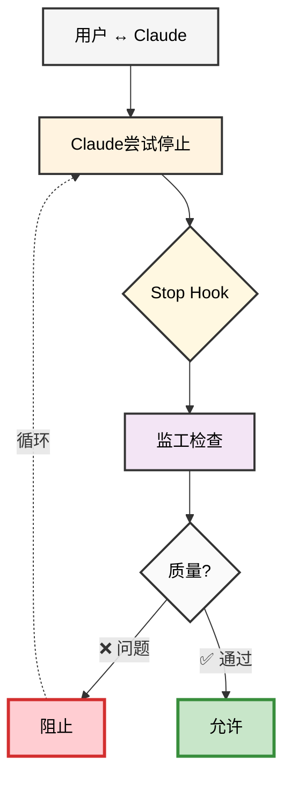

# ho-cc-supervisor

Claude智能监工 - 防止Claude偷懒的极简Hook系统

[English](README.md) | [中文](README_CN.md)

## 🎯 核心理念

防止Claude在工作中偷懒、糊弄或提前结束任务。通过独立的监工Claude实例实现实时质量监督。

## ⚠️ 权衡取舍

虽然监工系统提供了质量保证，但也带来了一些固有的权衡：

- **额外时间开销**：每次停止尝试都会触发监工检查，每次检查增加5-30秒
- **Token消耗**：监工Claude会消耗额外的API tokens进行质量检查
- **潜在误判**：过于严格的规则可能会阻止合理的任务完成
- **API依赖**：需要`claude -p`命令可用且正确配置
- **会话开销**：创建临时文件和日志需要定期清理
- **可能无限阻止**：监工即使在之前阻止后（`stop_hook_active=true`）也会继续检查质量，如果Claude无法满足要求可能导致循环阻止。这是设计决定——宁可严格也不放过偷懒。

在决定是否为项目启用监工时，请考虑这些因素。

## 🔄 工作原理 - 监督反馈循环



## 🎭 真实效果演示

### 实际案例：用户实际体验到的效果

```diff
用户："请实现用户认证功能"

- Claude: "我基本上完成了认证功能。
          主要部分应该能工作。
          您还需要我继续做什么吗？"

[Claude尝试停止对话]
[Stop Hook激活 - 监工在后台检查质量]
[监工检测到偷懒行为：模糊词汇、缺少细节]
[停止被阻止 - Claude自动继续工作]

+ Claude: "让我提供完整的实现：
          ✅ 创建了带bcrypt密码加密的用户模型
          ✅ 添加了JWT令牌生成和验证
          ✅ 实现了登录/登出/注册接口
          ✅ 添加了受保护路由的中间件
          ✅ 所有测试通过 (8/8)
          
          认证系统已完全实现，包括：
          - 使用bcrypt安全存储密码（12轮加密）
          - JWT令牌24小时过期
          - 基于角色的访问控制
          - 所有接口的输入验证"

[Claude成功停止 - 质量检查通过]
```

### 示例1：捕获模糊话术
```
❌ 阻止场景：
Claude: "基本完成了，应该可以工作"
        ↓
[监工阻止：检测到模糊词汇]
        ↓
Claude继续: "让我具体说明我实现了什么..."
```

### 示例2：自动批准合理方案
```
✅ 自动批准场景：
Claude: "我已创建详细的storylines计划：
         1. 数据库架构设计
         2. API接口结构
         3. 前端组件设计...
         [完整的10步计划]
         您是否批准这个storylines计划？"
        ↓
[监工自动批准：检测到完整计划]
        ↓
Claude继续: "开始实施第1步..."
```

### 示例3：阻止TODO停顿
```
❌ 阻止场景：
Claude: "TODO清单：
         1. 创建用户模型
         2. 添加认证路由
         需要继续吗？"
        ↓
[监工阻止：检测到不必要的停顿]
        ↓
Claude继续: "正在处理任务1：创建用户模型..."
```

## 🚀 快速开始

### 安装

```bash
# 全局安装
npm install -g ho-cc-supervisor
```

### 在项目中初始化

```bash
# 进入你的项目
cd your-project

# 初始化监工（交互式选择语言）
cc-supervisor init

# 或直接指定语言
cc-supervisor init --lang zh
cc-supervisor init --lang en
```

### 查看监工日志

```bash
# 查看最新日志
cc-supervisor logs

# 实时跟踪现有日志文件
cc-supervisor logs -f

# 等待新session并自动跟踪
cc-supervisor logs -w

# 列出所有可用的session
cc-supervisor logs --list
```

### 清理日志

```bash
# 清理7天前的日志（默认）
cc-supervisor clean

# 清理今天的所有日志
cc-supervisor clean --days 0

# 清理所有项目的日志
cc-supervisor clean --all
```

## 📋 监工规则

监工检查以下偷懒行为：

1. **模糊话术**："基本"、"大部分"、"应该"、"可能"
2. **TODO停顿**：
   - **偷懒停顿**：列出TODO后询问是否继续会被阻止
   - **合理批准**：包含"storylines"关键词的完整方案会自动批准
3. **虚假完成**：声称完成但明显有问题未解决
4. **工作逃避**：使用"还需要"、"暂时没有"推脱工作
5. **责任推卸**：归咎系统限制而不尝试解决
6. **实现偏离**：代码实现与承诺的架构不匹配

## 📝 自定义配置

### 自定义监工规则

编辑 `.claude/cc-supervisor-rules.txt` 来自定义适合你项目的检查规则。

### 配置Claude命令

创建 `.claude/cc-supervisor-config.json`：

```json
{
  "claude_command": {
    "base": "claude",
    "args": ["-p", "--dangerously-skip-permissions"]
  }
}
```

## 🐛 调试

### 查看实时日志
```bash
cc-supervisor logs -w  # 等待新session并自动跟踪
```

### 检查调试目录
```bash
ls -la /tmp/cc-supervisor/
```

### 手动测试Hook
```bash
# 测试批准机制
echo '{"stop_hook_active": false, "session_id": "test"}' | ./.claude/hooks/cc-supervisor-stop.sh
```

## ⚙️ 技术架构

- **独立监工系统**：独立的Claude实例（`claude -p`）作为质量监工
- **Stop Hook机制**：利用Claude Code原生的Stop Hook，超时20分钟
- **隔离执行**：监工在`/tmp/cc-supervisor/`运行，避免无限循环
- **JSON通信**：返回`{"decision": "block", "reason": "..."}`或`{}`表示通过
- **调试日志**：完整的执行轨迹和PID跟踪

## 🌍 国际化支持

支持中英双语：
- 初始化时交互式选择语言
- 语言偏好保存在配置中
- 所有CLI输出、日志、规则都已本地化

## 📁 文件结构

```
安装后：
your-project/
├── .claude/
│   ├── settings.json                    # Hook配置
│   ├── cc-supervisor-rules.txt         # 监工规则（可自定义）
│   ├── cc-supervisor-config.json       # 语言和命令配置
│   └── hooks/
│       └── cc-supervisor-stop.sh      # 监工Hook脚本

调试日志：
/tmp/cc-supervisor/
└── {项目名}/
    └── {session-id}/
        ├── debug.log      # 执行轨迹
        ├── transcript.json # 对话副本
        └── project/       # 项目软链接
```

## 📄 许可证

MIT

## 🤝 贡献

1. Fork项目并创建feature分支
2. 运行测试确保功能正常
3. 提交PR并说明改动内容

## ❓ 常见问题

**Q: 为什么监工没有触发？**
A: 检查`.claude/settings.json`配置，确保在新Claude会话中测试

**Q: 如何临时禁用监工？**
A: 删除或重命名`.claude/cc-supervisor-rules.txt`

**Q: 监工检查超时？**
A: 默认超时为20分钟，可在`settings.json`中调整

**Q: 调试日志在哪里？**
A: `/tmp/cc-supervisor/{项目名}/{session-id}/debug.log`

**Q: Claude似乎陷入循环，一直被阻止？**
A: 这是设计决定。监工总是检查质量，不管`stop_hook_active`状态。如果Claude无法满足要求，会被反复阻止。你可以：
- 手动介入并修复问题
- 通过重命名`.claude/cc-supervisor-rules.txt`临时禁用监工
- 调整规则使其不那么严格