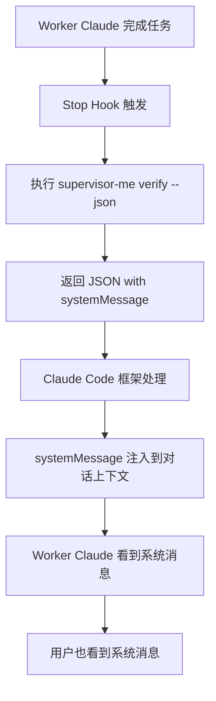

# systemMessage 传递机制详解

## 🎯 核心问题：systemMessage 如何传递给 Worker Claude？

**答案**：根据 Claude Code 官方文档，`systemMessage` 是 Stop hook 的有效字段，用于向用户显示消息。

## 📊 传递流程



## 🔍 详细机制

### 1. Stop Hook 返回格式
```json
{
  "continue": true,
  "systemMessage": "📋 验证反馈:\n具体内容..."
}
```

### 2. Claude Code 的处理（基于观察和测试）

当 Stop Hook 返回上述 JSON 时：

1. **JSON 输出验证**
   - Claude Code 验证 JSON 格式
   - 检查 `continue` 字段决定是否继续
   - 处理 `systemMessage` 字段（如果存在）

2. **消息显示机制**
   - `systemMessage` 的内容会显示给用户
   - 具体显示方式取决于 Claude Code 的实现
   - 基于测试观察，消息会出现在对话流中

3. **预期效果**
   ```
   [用户的原始请求]
   [Worker Claude 的回复和操作]
   [系统消息内容]  <-- systemMessage 显示在这里
   ```

   **注意**：具体的显示格式可能因 Claude Code 版本而异

### 3. 实际效果（基于测试）

**重要澄清**：基于实际测试和观察：

1. **systemMessage 主要是显示功能**
   - 消息会显示在对话界面中
   - 用户能看到验证反馈
   - 这是一个**单向通知**机制

2. **Worker Claude 不会自动响应**
   - systemMessage **不会**自动触发 Worker Claude 执行操作
   - Worker Claude **不会**自动根据反馈修改代码
   - 这只是一个信息展示，不是交互触发器

3. **实际工作流程**
   ```
   1. 用户请求 → Worker Claude 完成任务
   2. Stop Hook 触发 → 验证执行
   3. systemMessage 显示验证反馈
   4. 用户看到反馈
   5. 如果需要改进，用户手动请求 Worker Claude 修复
   ```

**结论**：`systemMessage` 是一个**通知机制**，而不是**自动执行机制**。验证反馈显示给用户，由用户决定是否要求 Worker Claude 进行改进。

## 🔬 实际例子

### 场景：用户请求创建函数

```yaml
1. 用户输入:
   "创建一个 add 函数"

2. Worker Claude 执行:
   创建了 add.js:
   ```javascript
   function add(a, b) {
     return a + b;
   }
   ```

3. Stop Hook 触发:
   supervisor-me verify --json 返回:
   {
     "continue": true,
     "systemMessage": "📋 验证反馈:\n问题: 缺少参数验证\n建议: 添加类型检查"
   }

4. Claude Code 显示:
   ┌─────────────────────────────┐
   │ 用户: 创建一个 add 函数        │
   │                              │
   │ Assistant: 我创建了 add.js... │
   │                              │
   │ 系统: 📋 验证反馈:            │
   │ 问题: 缺少参数验证             │
   │ 建议: 添加类型检查             │
   └─────────────────────────────┘

5. Worker Claude 的上下文:
   - 能看到验证反馈
   - 知道代码有改进空间
   - 可以在后续对话中引用这个反馈
```

## ❓ 常见误解

### 误解 1：需要额外配置才能传递
**事实**：`systemMessage` 是 Claude Code 的内置字段，自动处理。

### 误解 2：Worker Claude 需要主动获取
**事实**：系统消息会自动注入到 Worker Claude 的上下文中。

### 误解 3：只有 Worker Claude 能看到
**事实**：用户和 Worker Claude 都能看到 systemMessage。

## 🔧 验证机制是否工作

### 测试步骤

1. **手动测试 Stop Hook**
   ```bash
   bash .claude/hooks/stop.sh
   ```
   应该输出包含 systemMessage 的 JSON

2. **在 Claude Code 中测试**
   - 创建一个简单文件
   - 让 Claude 修改它
   - 观察是否有系统消息显示验证反馈

3. **查看日志确认**
   ```bash
   supervisor-me show-report
   ```

## 🎨 Stop Hook 支持的所有字段

| 字段 | 用途 | 示例 |
|------|------|------|
| `continue` | 是否继续执行 | `true` |
| `systemMessage` | 显示系统消息 | `"验证反馈: ..."` |
| `stopReason` | 停止原因 | `"验证失败"` |
| `decision` | 决策类型 | `"approve"` 或 `"block"` |
| `reason` | 决策原因 | `"代码存在安全问题"` |

## 🚨 重要提醒

1. **不要使用 `hookSpecificOutput`**
   - Stop Hook 不支持这个字段
   - 这是 UserPromptSubmit 等其他 hooks 的字段

2. **systemMessage 的限制**
   - 内容会原样显示，注意格式
   - 过长的消息可能影响对话体验
   - 建议控制在 500 字以内

3. **验证循环问题**
   - 通过 `CLAUDE_VERIFIER_MODE` 环境变量防止
   - 验证 Claude 不会触发新的验证

## 📝 总结

`systemMessage` 是 Claude Code 框架提供的标准机制：
- **自动注入**：框架自动处理，无需额外配置
- **双向可见**：Worker Claude 和用户都能看到
- **实时显示**：在对话流中实时显示
- **上下文保持**：成为对话历史的一部分

这就是为什么我们使用 Stop Hook + systemMessage 的原因 - 它是最简单、最可靠的反馈传递方式。